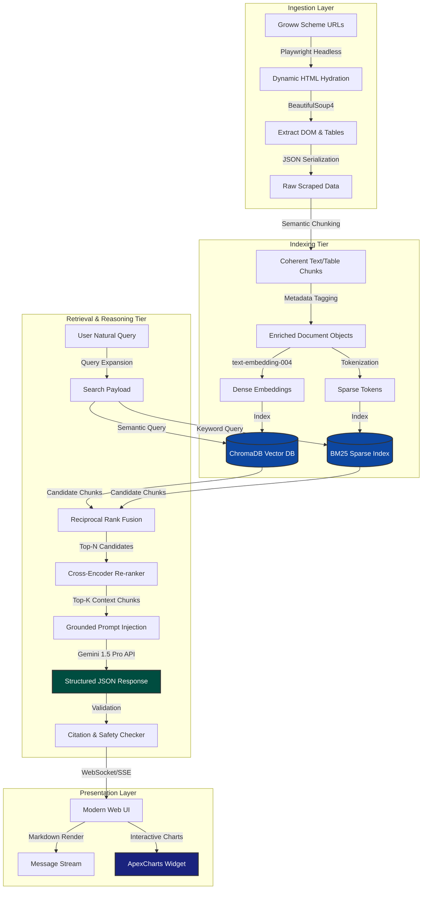
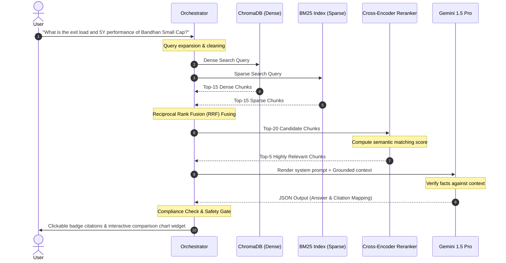

# System Architecture: RAG-Based Mutual Fund FAQ Chatbot

This document details the production-grade, compliance-first system architecture for the **AI-Powered Retrieval-Augmented Generation (RAG) Mutual Fund FAQ Chatbot**. This system is specifically designed to crawl target Groww product pages, index financial metrics and manager profiles, retrieve grounded context, and serve an interactive user interface featuring dynamic multi-fund comparison charts.


### High-Level Workflow Flowchart
To understand the chronological progression from the user's perspective, this high-level flowchart maps out the sequential execution flow:


---

## 1. High-Level Architecture Topology

The application is structured into four core layers:
1.  **Ingestion & Scraping Pipeline:** Asynchronous headless crawling of Groww scheme pages to extract raw tabular, biographical, and metric data.
2.  **Storage & Indexing Tier:** Document parsing, metadata tagging, dense semantic embedding, and hybrid sparse-dense database indexing.
3.  **Grounded Retrieval & Reasoning Loop:** Context query translation, hybrid search fusion, cross-encoder re-ranking, and structured prompt engineering with LLMs.
4.  **Premium Presentation Layer:** Ultra-responsive web dashboard with conversation threads and interactive multi-fund charting components (ApexCharts).



---

## 2. Ingestion & Scraping Pipeline

Groww mutual fund pages load content dynamically using client-side React frameworks. Standard static scraping libraries (like `urllib` or `requests`) fail to capture dynamically rendered tables. 

### Ingestion Flow
1.  **Headless Execution:** A Playwright script runs in headless mode, navigating to the target Groww URLs. It waits for the `#scheme-details` container and table grids to fully hydrate.
2.  **DOM Extraction:** The fully loaded DOM is passed to `BeautifulSoup4` for high-speed parsing.
3.  **Data Grid Extraction:**
    *   **NAV & AUM:** Extracted from the primary header cards.
    *   **Expense Ratio, Exit Load, Tax:** Extracted from the dynamic "Exit Load & Tax" accordion panels.
    *   **Holdings Table:** Scraped by traversing the rows of the portfolio holdings table.
    *   **Fund Manager Card:** Biographical details (names, tenures, educational profiles) are scraped from the "Fund Management" accordion section.
    *   **Work History:** Chronicled career text blocks are scraped from the secondary manager profile views.
    *   **Public Ratings:** Star scores (e.g., `4.8`) and user counts are parsed from the scheme review metrics.
    *   **Historical Timeline Returns:** The 3-year, 5-year, 7-year, and 10-year percentage performance figures are extracted from the historical returns widget.

### Ingestion Scheduling & Automated Trigger
To ensure the chatbot always serves the most up-to-date and compliant financial information (NAV, portfolio holdings, expense ratios, ratings), the ingestion component is automated using an active scheduler (such as `APScheduler` in Python or a container cron-job):
*   **Trigger Schedule:** Triggers **everyday at 09:15 AM IST (03:45 AM UTC)**.
*   **Operational Rationale:** Scraping at 09:15 AM IST ensures that the knowledge base is fully updated with new NAV figures, rating refreshes, and portfolio allocations right before the Indian equity markets open.
*   **Processing Flow:** The scheduler launches the headless Playwright scraper to crawl the target URLs, compares HTML checksums against existing values, processes chunk updates for any modified data, updates ChromaDB vectors and BM25 sparse indices, and logs execution.

### Ingestion Schema Format (JSON)
```json
{
  "fund_name": "Nippon India Small Cap Fund Direct Growth",
  "source_url": "https://groww.in/mutual-funds/nippon-india-small-cap-fund-direct-growth",
  "last_scraped_timestamp": "2026-06-01T15:00:00Z",
  "current_nav": 164.50,
  "aum_in_crores": 51230.40,
  "expense_ratio_pct": 0.68,
  "public_rating": {
    "stars": 4.8,
    "total_reviews": 8943
  },
  "fund_managers": [
    {
      "name": "Samir Rachh",
      "tenure_start": "2017-01-01",
      "education": "B.Com, Mumbai University",
      "work_history": [
        "Fund Manager at Nippon India Mutual Fund since 2017.",
        "Previously Head of Research at Hinduja Group.",
        "Over 25 years of experience in equity research and investment."
      ]
    }
  ],
  "performance_timelines": {
    "3_year_return_pct": 32.45,
    "5_year_return_pct": 28.12,
    "7_year_return_pct": 21.90,
    "10_year_return_pct": 24.15
  }
}
```

---

## 3. Storage & Hybrid Indexing Tier

Scraped JSON data is split into semantic paragraphs and tables, and loaded into a dual-indexing system to support semantic and exact keyword search.

### Chunking Strategy
*   **Grid Tables:** Expense Ratios, Exit Loads, and Top Holdings are converted to clean Markdown Tables and indexed as single contiguous chunks to prevent splitting related columns.
*   **Biographies:** Chronological fund manager work histories are grouped into paragraph blocks with heading contexts (e.g., `"Work History of Samir Rachh, Manager of Nippon India Small Cap Fund:"`).
*   **Returns Timelines:** Performance matrices are grouped into structured sentence templates (e.g., `"The 5-year annualized return for Nippon India Small Cap Fund is 28.12%."`).

### Hybrid Indexing Setup
*   **Dense Semantic Search:** Text chunks are transformed into 768-dimensional dense vectors using Google's `text-embedding-004` model. These are stored in a local **ChromaDB** instance.
*   **Sparse Keyword Search:** The same chunks are tokenized and loaded into an in-memory **BM25** sparse index. This ensures that exact matches for fund names (e.g., `"Zerodha"`) or manager names (e.g., `"Sohini"`) are retrieved with 100% precision.

---

## 4. Grounded Retrieval & Re-ranking Loop



### Hybrid Score Fusion Formula (RRF)
To merge vector database ranks ($R_{dense}$) with BM25 ranks ($R_{sparse}$), the system calculates a fused score for each chunk ($d$):

$$Score_{RRF}(d) = \frac{1}{k + R_{dense}(d)} + \frac{1}{k + R_{sparse}(d)}$$

*(Where constant $k = 60$ smooths out outlier ranks).*

---

## 5. presentations Layer & Interactive Comparison Graph

The front-end conversational application renders dynamic, client-side React or Javascript components to allow users to visualize financial metrics interactively.

### Interactive 3-Fund Comparison Widget
When a user asks to compare schemes (e.g., *"Compare Bandhan Small Cap, Nippon India Small Cap, and Zerodha Passive FoF"*), the chat interface bypasses standard text generation and renders a customized **ApexCharts** visualization:

```javascript
// Front-end State & Rendering Logic Blueprint
class ComparisonChartWidget extends HTMLElement {
  constructor() {
    super();
    this.selectedTimeline = '5Y'; // Default timeline
    this.activeFunds = []; // Up to 3 funds
  }

  connectedCallback() {
    this.activeFunds = JSON.parse(this.getAttribute('funds'));
    this.render();
  }

  setTimeline(timeline) {
    this.selectedTimeline = timeline;
    this.updateChart();
  }

  updateChart() {
    // 1. Verify eligibility of each fund for the selected timeline
    const chartSeries = this.activeFunds.map(fund => {
      const returnPct = fund.performance[this.selectedTimeline];
      if (returnPct === null || returnPct === undefined) {
        return { name: fund.name, data: null, error: 'Not Active' };
      }
      return {
        name: fund.name,
        data: this.generateTimelineData(fund, this.selectedTimeline)
      };
    });

    // 2. Render series with ApexCharts using rich tooltips on hover
    const options = {
      series: chartSeries.filter(s => s.data !== null),
      chart: { type: 'line', height: 350, toolbar: { show: false } },
      stroke: { curve: 'smooth', width: 3 },
      colors: ['#00E396', '#008FFB', '#FEB019'], // Sleek HSL-harmonious tones
      tooltip: {
        shared: true, // Show all 3 series simultaneously on hover
        intersect: false,
        y: {
          formatter: (val) => `${val}% Return`
        }
      },
      xaxis: {
        type: 'datetime'
      }
    };
    
    new ApexCharts(this.querySelector('#chart-area'), options).render();
  }
}
```

### Key UI Features
*   **Timeline Selection Tabs:** Clickable tabs at the top for **3 Years**, **5 Years**, **7 Years**, and **10 Years**.
*   **Timeline Hover Control:** A unified, shared vertical guide-line that moves with the user's cursor. Hovering instantly triggers an interactive tooltip displaying simultaneous returns for all three schemes at that point in time.
*   **Inactive State Alerts:** If a fund (e.g., Zerodha Passive FoF) has not been active for the selected timeline (e.g., 7Y or 10Y), the series line is cleanly hidden, and an warning message (e.g., *"Zerodha Passive FoF was established in 2023 and is not active for the 7-year timeline"*) is rendered below the chart.
*   **Glassmorphic Container:** The chart sits in a beautiful translucent card (`backdrop-filter: blur(16px)`) with harmonious dark-mode colors matching premium web guidelines.
