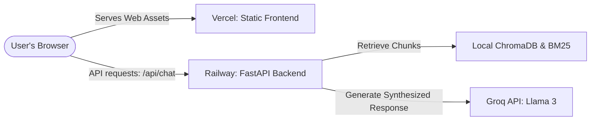

# Deployment Plan: RAG Mutual Fund FAQ Chatbot

This document outlines the step-by-step production deployment plan for hosting the **FastAPI Backend on Railway** and the **Glassmorphic Frontend on Vercel**.

---

## 1. Architecture Overview



- **Frontend**: Hosted on **Vercel** as a high-performance static web application serving HTML, CSS, and JS.
- **Backend**: Hosted on **Railway** as a persistent Python container exposing the FastAPI service.
- **Database**: Cosine similarity **ChromaDB** dense vector store and **BM25** sparse model. Since the target mutual funds are strictly scoped and crawled daily, the database files (`./db` and `data/bm25_store.pkl`) are pre-generated and committed into git to ensure a stateless backend setup.

---

## 2. Backend Deployment on Railway

Railway is ideal for python container deployment as it reads our Procfile and manages environment variables natively.

### Prerequisites

We have created the deployment config files:
1.  **[Procfile](file:///c:/Projects/RAG%20mutual%20FAQ%20chatbot/Procfile)** at the root directory:
    ```txt
    web: uvicorn backend.main:app --host 0.0.0.0 --port $PORT
    ```
2.  **[requirements.txt](file:///c:/Projects/RAG%20mutual%20FAQ%20chatbot/requirements.txt)**: Confirms all Python dependencies (FastAPI, uvicorn, chromadb, rank-bm25, sentence-transformers, bs4, etc.) are loaded during deployment.

### Steps to Deploy:
1.  **Push Code to GitHub**: Commit and push the repository to GitHub. Ensure the `./db/` and `data/bm25_store.pkl` folders/files are committed (or run the indexing task in the build command).
2.  **Create a Railway Project**:
    - Sign in to [Railway.app](https://railway.app).
    - Click **New Project** -> **Deploy from GitHub repo** and select your mutual fund chatbot repository.
3.  **Configure Environment Variables**:
    Under the **Variables** tab of the service, add:
    - `GROQ_API_KEY`: `gsk_...` (Your Groq API key)
    - `GROQ_LLM_MODEL`: `llama-3.3-70b-versatile` (Primary synthesizer model)
    - `GEMINI_API_KEY`: *(Optional)* `AIzaSy...` (Used if regenerating text-embedding-004 vectors)
    - `PORT`: (Managed automatically by Railway, bound via `$PORT` in Procfile)
4.  **Expose Public URL**:
    - Go to **Settings** -> **Public Networking** -> click **Generate Domain**.
    - Copy the generated domain (e.g., `https://your-backend-service.up.railway.app`).

---

## 3. Frontend Deployment on Vercel

Vercel is optimized for frontend assets. We host the `./frontend` folder as a static site.

### Configure Production API Base URL:
Before deploying, ensure that the API URL points to the production Railway backend instead of localhost. We have configured a dynamic switch inside [frontend/app.js](file:///c:/Projects/RAG%20mutual%20FAQ%20chatbot/frontend/app.js#L68-L72):
```javascript
const API_BASE_URL = window.location.hostname === "127.0.0.1" || window.location.hostname === "localhost"
    ? "http://127.0.0.1:8000"
    : "https://your-backend-service.up.railway.app"; // <-- Paste your Railway domain here
```

### Steps to Deploy:
1.  **Configure Project on Vercel**:
    - Sign in to [Vercel](https://vercel.com).
    - Click **Add New** -> **Project** -> Import the same GitHub repository.
2.  **Adjust Root Directory**:
    - In the project configuration, find **Root Directory**.
    - Click **Edit** and set it to **`frontend`** (this instructs Vercel to only deploy and serve assets from inside our `./frontend` folder).
3.  **Deploy**:
    - Click **Deploy**. Vercel will build and host the static files instantly.
    - Copy the generated frontend URL to access the application.

---

## 4. CORS & Cross-Domain Security

The application supports cross-origin requests out of the box. In **[backend/main.py](file:///c:/Projects/RAG%20mutual%20FAQ%20chatbot/backend/main.py#L24-L30)**, CORS middleware is configured to permit communication from Vercel:
```python
app.add_middleware(
    CORSMiddleware,
    allow_origins=["*"], # Permits Vercel domains to fetch chat requests
    allow_credentials=True,
    allow_methods=["*"],
    allow_headers=["*"],
)
```
*(For enhanced production security, you can replace `"*"` in `allow_origins` with your exact Vercel deployment URL.)*

---

## 5. Local Execution (Development)

To run the application locally for debugging or testing:
1.  Start the local FastAPI service:
    ```powershell
    python backend/main.py
    ```
2.  Open **`http://127.0.0.1:8000/`** in your browser.
