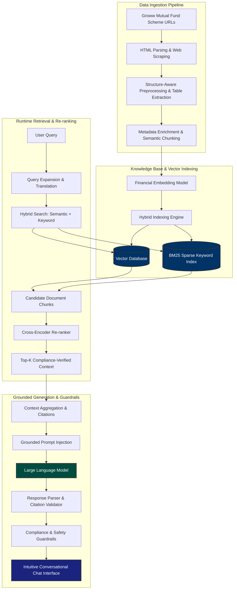

# Problem Statement: RAG-Based Mutual Fund FAQ Chatbot

> [!IMPORTANT]
> **Project Context:** Financial advisory and customer support services are highly sensitive domains subject to strict compliance rules. Inaccurate responses ("hallucinations") are unacceptable under regulatory standards (such as SEBI and SEC). This project builds a production-grade, compliance-first, and highly accurate **Retrieval-Augmented Generation (RAG)** virtual assistant designed to navigate dense financial literature and provide verified, audit-ready answers.

---

## 1. Project Vision & Business Drivers

In the wealth management and mutual fund industry, relationship managers, financial advisors, and retail investors deal with a massive volume of dense, unstructured legal documents. Making decisions based on outdated or incorrect figures can result in severe financial loss and heavy regulatory penalties.

### Key Document Ecosystem
*   **Scheme Information Documents (SIDs):** 100+ page prospectuses detailing investment objectives, asset allocation patterns, risk factors, fee structures, and exit loads.
*   **Key Information Memorandums (KIMs):** Highly dense, legal summaries that are mandatory for investors to read before making a subscription.
*   **Scheme Product Pages:** Dynamic data sheets showing active portfolios, current Net Asset Values (NAVs), expense ratios, exit loads, **current Fund Manager names and educational profiles**, **comprehensive chronological Work Histories**, official **Groww Public Ratings (Star Ratings and reviews)**, and **historical performance returns over 3, 5, 7, and 10-year horizons**.

### The Core Challenges
1.  **Dense, Fragmented Legal Texts:** Retail investors struggle to understand technical terminology and navigate complex tables to find simple answers (e.g., *"What is the exit load if I redeem within 6 months?"*).
2.  **Strict Regulatory Compliance:** Chatbots must strictly avoid speculative advice, portfolio predictions, or incorrect fee disclosures. All responses must be 100% grounded in verified source literature.
3.  **Dynamic, Real-time Data:** Financial statistics (NAVs, expense ratios, portfolio weightages) change frequently. Off-the-shelf, pre-trained Large Language Models (LLMs) cannot handle this dynamic context and are prone to hallucinations.
4.  **Keyword Search Limits:** Traditional search engines rely on exact keyword matches, completely failing on conceptual natural language queries (e.g., *"Compare Nippon Small Cap vs Bandhan Small Cap performance over a 5-year timeline."*).

---

## 2. Scoped Data Sources (Target Scheme URLs)

For the current phase of this project, data ingestion and query boundaries are strictly restricted to the following 8 Groww mutual fund scheme detail pages:

| Fund Scheme Name | Ingestion / Source URL |
| :--- | :--- |
| **Bandhan Small Cap Fund** | [bandhan-small-cap-fund-direct-growth](https://groww.in/mutual-funds/bandhan-small-cap-fund-direct-growth) |
| **Bandhan Midcap Fund** | [bandhan-midcap-fund-direct-growth](https://groww.in/mutual-funds/bandhan-midcap-fund-direct-growth) |
| **Bandhan Multi Cap Fund** | [bandhan-multi-cap-fund-direct-growth](https://groww.in/mutual-funds/bandhan-multi-cap-fund-direct-growth) |
| **Edelweiss Mid and Small Cap Fund** | [edelweiss-mid-and-small-cap-fund-direct-growth](https://groww.in/mutual-funds/edelweiss-mid-and-small-cap-fund-direct-growth) |
| **Zerodha Multi Asset Passive FoF** | [zerodha-multi-asset-passive-fof-direct-growth](https://groww.in/mutual-funds/zerodha-multi-asset-passive-fof-direct-growth) |
| **Parag Parikh Long Term Value Fund** | [parag-parikh-long-term-value-fund-direct-growth](https://groww.in/mutual-funds/parag-parikh-long-term-value-fund-direct-growth) |
| **Nippon India Small Cap Fund** | [nippon-india-small-cap-fund-direct-growth](https://groww.in/mutual-funds/nippon-india-small-cap-fund-direct-growth) |
| **Nippon India Multi Asset Allocation Fund** | [nippon-india-multi-asset-allocation-fund-direct-growth](https://groww.in/mutual-funds/nippon-india-multi-asset-allocation-fund-direct-growth) |

---

## 3. End-to-End System Architecture

The following diagram illustrates the structured data flow, from multi-format document parsing to vector indexing and the runtime retrieval-generation conversational loop.



---

## 4. Data Metadata Model

To achieve strict financial compliance and auditability, each document chunk must be enriched with a detailed metadata schema. This ensures that every generated response is paired with precise, verifiable source citations.

| Metadata Field | Type | Description | Example |
| :--- | :--- | :--- | :--- |
| `chunk_id` | String | Unique hash of the chunk contents and source. | `chk_nippon_small_094a` |
| `source_url` | String | The official source Groww page URL for this data. | `https://groww.in/mutual-funds/...` |
| `fund_name` | String | Standardized name of the mutual fund scheme. | `Nippon India Small Cap Fund` |
| `metric_category`| Enum | Classification of the metric or details represented. | `NAV` \| `Expense Ratio` \| `Exit Load` \| `Holdings` \| `AUM` \| `Fund Manager` \| `Work History` \| `Public Rating` \| `Performance Timeline` |
| `section_header`| String | Specific section header on the scheme page. | `Fund Management` \| `Holdings` \| `Exit Load & Tax` \| `Ratings` \| `Performance` |
| `last_scraped` | Timestamp| The time the page was crawled to ensure real-time accuracy.| `2026-06-01T15:00:00Z` |
| `hash_checksum` | String | MD5 hash to detect scheme page updates and verify integrity. | `d41d8cd98f00b204e9800998ecf8427e` |

---

## 5. Technical Stack Recommendation

To build a high-performance, responsive, and robust application, we recommend the following professional-grade components:

| Module | Core Technology | Selection Rationale |
| :--- | :--- | :--- |
| **Ingestion Pipeline** | `Python`, `BeautifulSoup4`, `Playwright` | `Playwright` handles dynamic JavaScript execution to load React components; `BeautifulSoup4` extracts specific data grids (NAV, AUM, exit loads, holdings) and biographical blocks (fund manager work history, ratings, and historical performance timelines). |
| **Vector DB & Search** | `ChromaDB` or `pgvector` | `ChromaDB` provides rapid local setup and rich metadata filtering, while `pgvector` scales perfectly for standard Postgres relational stacks. |
| **Orchestration** | `LangChain` or `LlamaIndex` | Simplifies retrieval routing, agentic memory management, hybrid search fusing, and context prompt formatting. |
| **LLM & Embeddings** | `Gemini 1.5 Pro` (API) | Large 2M context window facilitates multi-document synthesis; native support for structured JSON schemas ensures rigid citation outputs. |
| **Conversational UI** | `HTML5`, `Vanilla CSS`, `Javascript`, `ApexCharts` or `Chart.js` | Ultra-modern, responsive chat interface featuring smooth animations, markdown message bubbles, star-rating visualization widgets, and interactive citation badges. Includes `ApexCharts` or `Chart.js` to render highly responsive, multi-series performance comparison line charts for up to 3 selected funds over customizable, hover-sensitive timelines (3Y, 5Y, 7Y, 10Y). |

---

## 6. Grounded Prompt Engineering & Guardrails

To completely eliminate hallucinations, the system uses a strict "closed-book" system prompt. This enforces that the LLM operates solely on the provided context.

```python
# System Guardrail Instructions
SYSTEM_PROMPT = """
You are a highly professional, compliance-first Virtual Assistant for Mutual Fund Investors and Advisors.
Your sole purpose is to answer questions accurately and objectively based ONLY on the provided verified context.

STRICT OPERATIONAL RULES:
1. Grounding: Rely strictly on the information provided in the Context section below. Do not extrapolate, infer, or bring in any outside knowledge.
2. Unanswerable Queries: If the provided Context does not contain sufficient details to confidently answer the user's question, state exactly this:
   "I'm sorry, but I cannot find that information in the official scheme documents. Please consult a financial advisor or the mutual fund's helpdesk."
   Do NOT try to guess, invent, or generalize.
3. Citations: Every statement or figure you state must be followed by an exact inline citation pointing to the source document and Groww URL.
   Format citations using markdown badges, e.g., `[Source Fund Name, Source URL]`.
4. Compliance: Do NOT provide subjective investment recommendations, speculative performance projections, or comparisons unless explicitly backed by the retrieved factsheet context.
5. Tone: Maintain a neutral, professional, and clear financial advisory tone.

CONTEXT DETAILS:
{retrieved_context}

USER QUERY:
{user_query}

ANSWER:
"""
```

---

## 7. Phase-by-Phase Development Checklist

- [ ] **Phase 1: Ingestion & Scraping Pipeline**
  - [ ] Set up Playwright/BeautifulSoup4 scripts to crawl the 8 targeted Groww mutual fund URLs.
  - [ ] Extract key quantitative grids: NAV, AUM, Expense Ratio, Exit Load, Asset Allocation, and Top Holdings.
  - [ ] Extract qualitative details: Current Fund Manager name(s), tenure, and educational backgrounds.
  - [ ] Scrape chronological **Fund Manager Work History** (past employers, other schemes managed).
  - [ ] Scrape the official **Groww Public Rating** (Star rating score and number of reviews).
  - [ ] Scrape historical returns data over **3 years, 5 years, 7 years, and 10 years** timelines (detecting if the fund was inactive during any period to handle dynamic availability).
  - [ ] Format extracted tables, returns, and biographies into structured markdown or JSON files while keeping metadata intact.

- [ ] **Phase 2: Embedding & Database Indexing**
  - [ ] Implement metadata enrichment (source URLs, fund names, metric categories).
  - [ ] Set up a local vector database instance (`ChromaDB`).
  - [ ] Generate high-fidelity vector representations and store chunks with indexed metadata fields.

- [ ] **Phase 3: Hybrid Retrieval & Re-ranking**
  - [ ] Integrate dense semantic search with sparse keyword search (`BM25`) to handle exact fund lookups and manager background checks.
  - [ ] Develop a metadata-filtering helper to search across specific funds or document types.
  - [ ] Integrate a cross-encoder re-ranking step to discard irrelevant chunks and rank the top-K contexts.

- [ ] **Phase 4: LLM Grounding & Compliance Routing**
  - [ ] Connect the retrieval pipeline with `Gemini 1.5 Pro` using LangChain/LlamaIndex.
  - [ ] Implement the compliance prompt template with strict guardrails.
  - [ ] Write a parser to extract citation metadata and render clickable reference tags.

- [ ] **Phase 5: Premium User Interface & Interactive Charting**
  - [ ] Design a stunning, interactive web application featuring glassmorphism elements, dynamic hover states, and smooth conversational scrolls.
  - [ ] Support rich rendering of markdown elements (bolding, custom tables, citation badges, star-rating visualization, manager bio cards).
  - [ ] Implement an **Interactive Multi-Fund Comparison Chart Widget** using `ApexCharts` or `Chart.js` that:
    - Supports side-by-side performance comparisons for up to 3 selected funds.
    - Features user-selectable timeline tabs for **3 years, 5 years, 7 years, and 10 years** (disabling options if a fund has not been active since then).
    - Features highly responsive hover states, letting the user hover over the timeline to trigger interactive tooltips displaying simultaneous comparative returns for all three funds.
  - [ ] Verify responsiveness across mobile, tablet, and desktop viewports.
