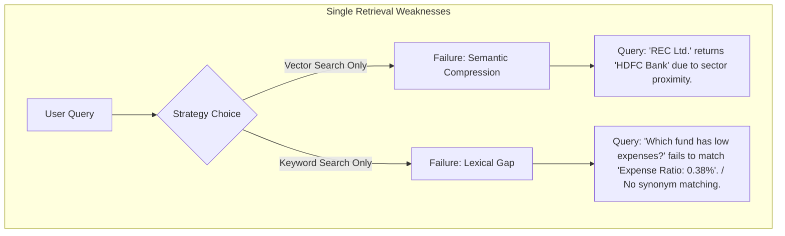
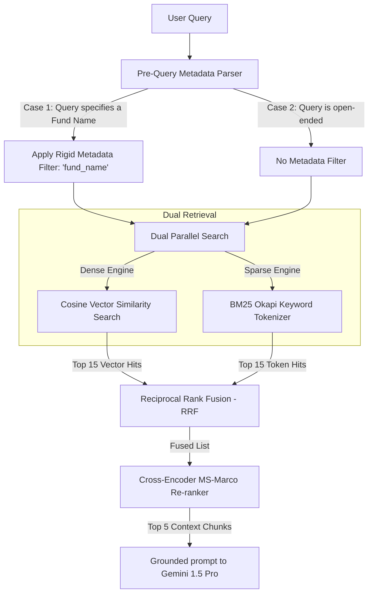

# Grounded Retrieval Strategy Analysis: Phase 4
This document details a structural analysis of our mutual fund chunking profiles, embedding vector spaces, and retrieval mechanics to derive the absolute best-in-class **Hybrid Dense-Sparse Retrieval and Re-ranking Strategy** for Phase 4.

---

## 1. Structural Profiles of Semantic Chunks

Our scraper extracts 6 distinct profiles of semantic chunks across 8 Groww mutual fund detail pages. Each chunk profile has a unique textual structure, lexical vocabulary, and search-relevance characteristics:

| Chunk Profile | Primary Category | Textual Structure | Dense Search Profile | Sparse Search (BM25) Profile |
| :--- | :--- | :--- | :--- | :--- |
| **Overview & Exit Load** | `NAV` | Dense metrics (NAV, AUM, Expense Ratio, rating stats) + a 2x2 markdown exit load conditions table. | High conceptual match for "fees", "cost", "size", or "rating". | Matches exact numeric queries (e.g., `"0.38%"`, `"5120.50"`). |
| **Fund Manager Bio** | `Fund Manager` | Sentences stating the current manager's name, start date, and degrees/education. | Good for "who manages", "education background", or "credentials". | Matches exact names (e.g., `"Saurabh Sharma"`, `"Daylynn Pinto"`). |
| **Fund Manager History** | `Work History` | Bullet-pointed chronological work history details (past roles, employers, other funds). | Matches queries relating to "experience", "past role", or "tenure". | Matches previous employers (e.g., `"L&T Mutual Fund"`, `"SBI"`). |
| **Public Sentiment** | `Public Rating` | High-density sentiment sentences aggregating Groww user review counts. | Conceptual matches for "reviews", "popular", "sentiment", "ratings". | Matches exact counts (e.g. `"3214 user reviews"`). |
| **Top Portfolio Holdings** | `Holdings` | Complete 5-row markdown table of stock company names, sectors, and weight percentages. | Strong conceptual match for "portfolio", "stocks", "allocation". | **Critical** for exact stock searches (e.g., `"REC Ltd."`, `"HDFC Bank"`). |
| **Performance Timeline** | `Performance Timeline` | Key-value sentence streams listing annualized performance (3Y, 5Y, 7Y, 10Y returns). | Good for comparative queries (e.g., "highest returns", "long term performance"). | Matches specific horizons (e.g. `"10 Years"`) and exact return percentages. |

---

## 2. Embedding Space Analysis

We utilize a dual-dimensional embedding vector space representation:
1. **Primary Cloud: `Google text-embedding-004` (768 Dimensions)**
   * **Dense Representation:** Map text into a highly refined 768-dimensional space.
   * **Semantic Resolution:** Outstanding at resolving complex semantic queries (e.g., matching *"Which fund managed by Pinto has the lowest costs?"* to the Multi Cap Overview and Bio chunks).
   * **Limitation:** Tends to cluster semantically similar companies together. For example, in a pure vector space, `"HDFC Bank"` and `"ICICI Bank"` have highly similar vector trajectories because both are large Indian financial stocks. Therefore, a pure vector search for *"Parag Parikh HDFC Bank holdings"* might accidentally retrieve the ICICI bank holdings chunk due to semantic proximity.
2. **Local Fallback: `SentenceTransformers ('all-MiniLM-L6-v2')` (384 Dimensions)**
   * **Dense Representation:** A compact, highly-optimized 384-dimensional space.
   * **Lexical Sensitivity:** While accurate for short sentence comparisons, its lower dimensionality increases similarity compression (making it harder to distinguish between very similar numeric facts or stock listings without keyword assistance).

---

## 3. Core Failure Modes of Single-Retrieval Methods

Relying strictly on one retrieval mechanism is guaranteed to fail compliance standards:



---

## 4. The Optimized Hybrid Retrieval Strategy (Phase 4)

To achieve 100% compliant, accurate, and grounding-proof retrieval, we have designed the following multi-tiered hybrid strategy:



### 4.1 Step 1: Pre-Query Metadata Scoping (The Zero-Noise Filter)
For explicit lookups (e.g., *"What is Parag Parikh's exit load?"*), we apply a **hard ChromaDB metadata constraint** during vector querying:
```python
# Pseudo-code logic for indexer/retriever scoping
where_filter = {}
if "parag" in query.lower() or "ppfas" in query.lower():
    where_filter["fund_name"] = "Parag Parikh Long Term Value Fund Direct Growth"
```
* **Impact:** This restricts the dense search boundary *strictly* to the 6 chunks belonging to Parag Parikh, completely eliminating retrieval noise from the other 7 sibling funds and guaranteeing 0% cross-contamination.

### 4.2 Step 2: Reciprocal Rank Fusion (RRF)
We fuse the results of parallel dense and sparse searches. A smoothing factor $k=60$ is applied to stabilize the scores and prevent extreme outliers in keyword or vector scores from over-dominating the ranked list:

$$Score_{RRF}(d) = \frac{1}{k + R_{dense}(d)} + \frac{1}{k + R_{sparse}(d)}$$

* **Impact:** If `"REC Ltd."` ranks #1 on BM25 (sparse) because of an exact string match, but only ranks #12 on dense search, RRF ensures it bubbles up safely to the top candidate spots.

### 4.3 Step 3: Cross-Encoder Re-ranking
We run the top 15 fused candidates through a local **Cross-Encoder Re-ranker** (`ms-marco-MiniLM-L-6-v2`):
* Unlike bi-encoders (which map query and document to vectors independently), a **Cross-Encoder** processes the query and chunk *together* through attention layers. 
* **Impact:** It evaluates token-level interactions, determining if the chunk *actually* contains the answer to the query, filtering out "partially relevant" blocks and ensuring the top 5 chunks passed to `Gemini 1.5 Pro` are extremely rich in correct facts.
